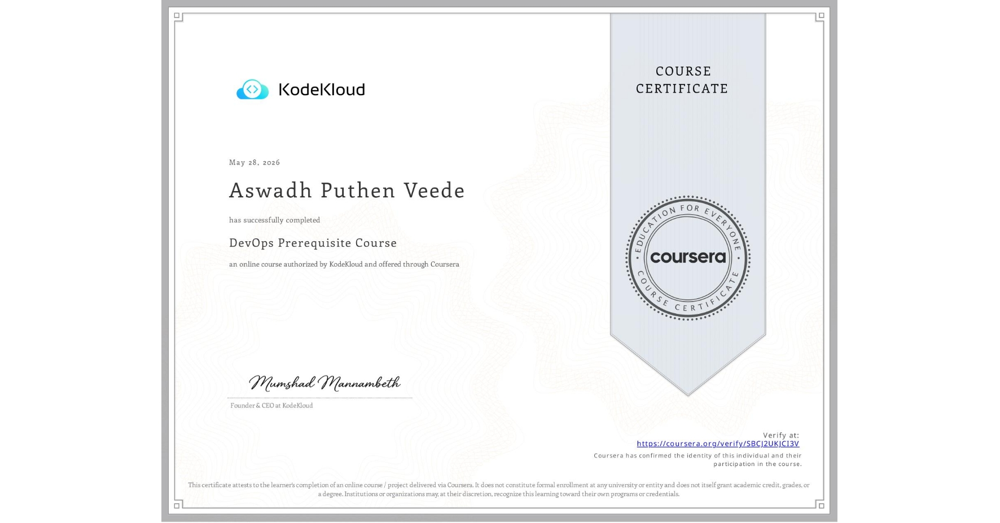
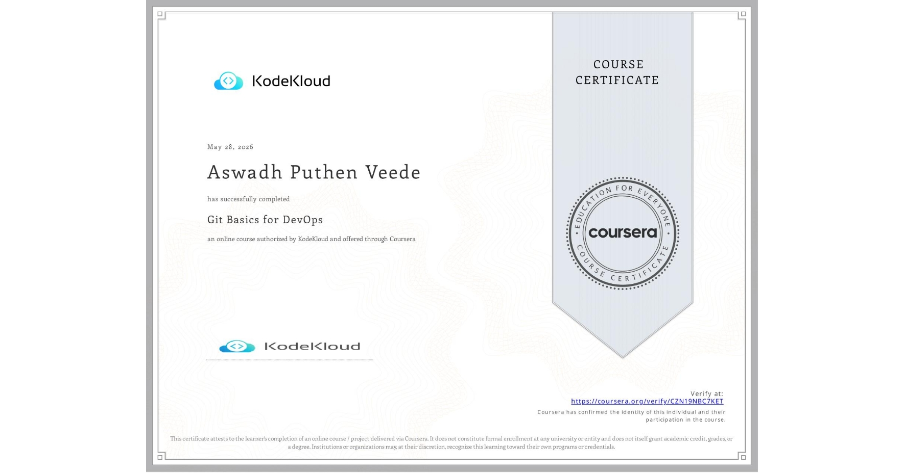

<!-- HEADER BANNER -->

  

<!-- ANIMATED TYPING EFFECT -->

  

<!-- INLINE CSS FOR PULSE ANIMATION & SPACING -->

<!-- ABOUT ME -->
<h2 align="center">👨‍💻 About Me</h2>

  <samp>
    <strong>DevOps Middle Engineer</strong> with 3+ years of experience in e‑commerce 
    specializing in Kubernetes, CI/CD, and Infrastructure as Code. 
    Passionate about automation, cloud‑native technologies, and building resilient systems.
  </samp>

<!-- STATS CARDS -->

  

<!-- WORK EXPERIENCE -->
<h2 align="center">💼 Professional Experience</h2>

<table align="center">
  <tr>
    <td align="center" width="50%">
      <h3>🏢 Citilink</h3>
      
<strong>Middle DevOps Engineer</strong>

      
<em>May 2023 – June 2026</em>

      

        • Microservices platform on Kubernetes: 30+ nodes, 450+ pods in prod 
        • Managed 12–14 services around catalog, product cards, and search 
        • Peak loads up to 3 000 RPS during promotional periods 
        • Hybrid infrastructure: On‑premise (prod) + Yandex Cloud / VK Cloud (dev/stage)
      

    </td>
    <td align="center" width="50%">
      <h3>🎓 Thesis Project</h3>
      
<strong>Virtual Machine Manager</strong>

      
<em>Using DevOps Tools</em>

      

        • Automated VM lifecycle management 
        • Infrastructure as Code implementation 
        • CI/CD pipeline for VM provisioning 
        • Monitoring and logging setup 
        • <a href="https://github.com/kosmovuz/vm-manager">🔗 View Repository</a>
      

    </td>
  </tr>
</table>

<!-- KEY ACHIEVEMENTS -->
<h2 align="center">🏆 Key Achievements</h2>

  <table>
    <tr>
      <td>🚀 <strong>40%</strong> faster CI/CD</td>
      <td>💰 <strong>20%</strong> cloud cost reduction</td>
      <td>📉 <strong>50%</strong> fewer deployment incidents</td>
    </tr>
    <tr>
      <td>📈 <strong>99.9% → 99.98%</strong> availability</td>
      <td>⏱️ <strong>2 days → 2 hours</strong> service onboarding</td>
      <td>📊 <strong>25%</strong> alert noise reduction</td>
    </tr>
  </table>

<!-- TECH STACK – PULSING ICONS -->
<h2 align="center">🛠️ Technology Stack</h2>

  
  
  
  
  
  
  
  
  
  
  
  
  
  
  
  
  <!-- Yandex Cloud & VK Cloud as badges with same size and pulse -->
  

<!-- Skill levels -->

  
  
  
  
  
  
  
  

<!-- FEATURED PROJECT -->
<h2 align="center">📁 Featured Project</h2>

  <a href="https://github.com/kosmovuz/vm-manager">
    <strong>🎮 Virtual Machine Manager</strong>
  </a> 
  <em>Automated VM lifecycle management using DevOps principles</em>

<!-- CERTIFICATES -->
<h2 align="center">📜 Certifications</h2>

  <table>
    <tr>
      <td align="center">
        <a href="assets/certificates/SBCJ2UKJCI3V.jpeg" target="_blank">
          
           
          <strong>Certificate 1</strong>
        </a>
      </td>
      <td align="center">
        <a href="assets/certificates/CZN19NBC7KET.jpeg" target="_blank">
          
           
          <strong>Certificate 2</strong>
        </a>
      </td>
      <td align="center">
        <a href="assets/certificates/SHIFT%20certificate.png" target="_blank">
          
           
          <strong>Shift Certificate</strong>
        </a>
      </td>
    </tr>
  </table>

<!-- CONTRIBUTION GRAPH -->
<h2 align="center">📈 Contribution Graph</h2>

  

  View full contributions on <a href="https://github.com/kosmovuz">GitHub</a>

<!-- CONTACT -->
<h2 align="center">🤝 Connect with Me</h2>

  
  
  
  

<!-- VISITOR COUNTER -->

  

<!-- FOOTER -->

  

<!-- STREAK STATS -->

  

